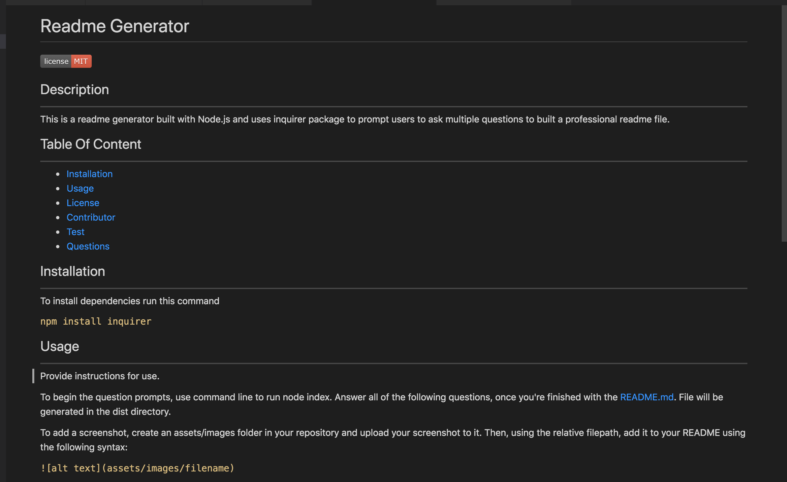
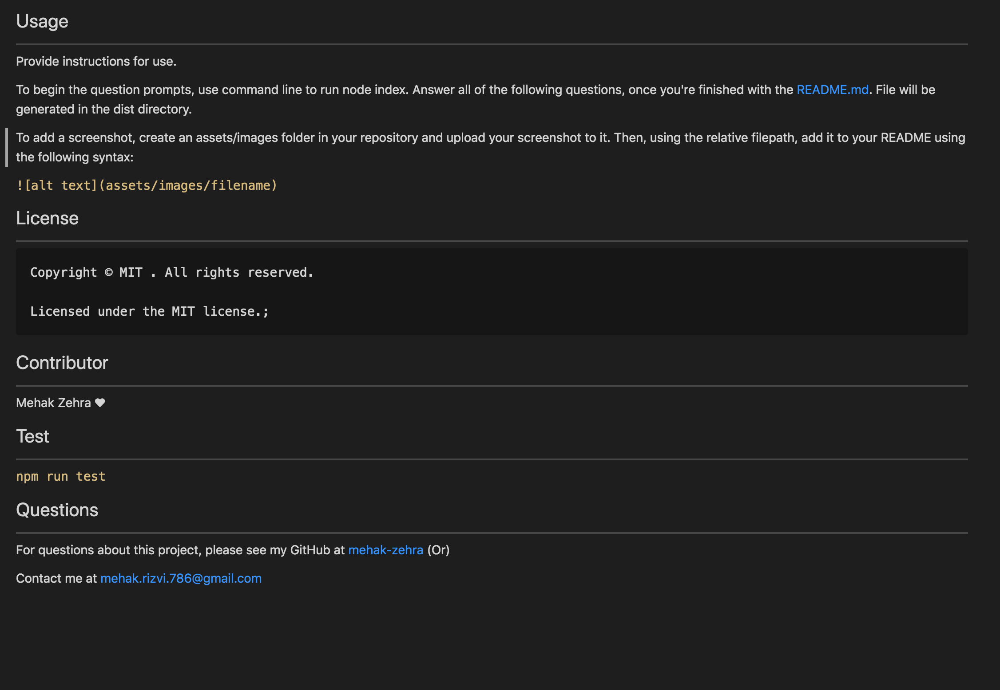

# Readme Generator
  

  ## Description  
 
  This is a readme generator built with Node.js and uses inquirer package to prompt users to ask multiple questions to built a professional readme file

  ## Table Of Content  
 
  * [Installation](#installation)
  * [Usage](#usage)
  * [Screenshots](#screenshots)
  * [Technologies](#technologies)
  * [Test](#test)
  * [Questions](#questions)
  * [Contributor](#contributor)
  
  ## Installation  

  To install dependencies run this command 

  ```npm install inquirer```

  ## Getting Started 

  After you have cloned the git repository, and ran the necessary installs, execute the either of the following command to run the application in the root directory

  ```node index.js```
  ```node index```

  ## Usage  

  Provide instructions for use. 
 
  To begin the question prompts, use command line to run node index.
  Answer all of the following questions, once you're finished with the README.md.
  File will be generated in the dist directory.
  
  To add a screenshot, create an assets/images folder in your repository and upload your screenshot to it. Then, using the relative filepath, add it to your README using the following syntax:
 
  ``````
  ## License  

  None

 ## Screenshots

  
  
  
  ## Technologies

    Node.js
    NPM
    Inquirer.js
  ## Test  
 
  ```npm run test```
  ## Questions  

  For questions about this project, please see my GitHub at [mehak-zehra](https://github.com/mehak-zehra)  (Or) 

  Contact me at mehak.rizvi.786@gmail.com

   ## Contributor  

  Mehak Zehra ♥ 